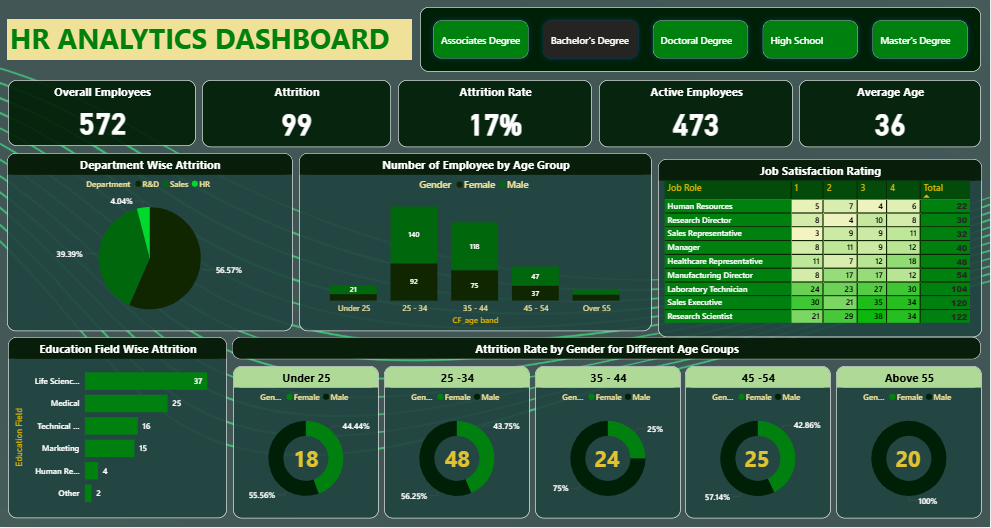

# 📊 HR Analytics Capstone Project (End-to-End)

## 📌 Project Overview
This is a complete end-to-end HR Analytics project developed to analyze employee data and uncover key insights related to attrition, workforce demographics, and job satisfaction.

The project integrates multiple tools and technologies including Excel, PostgreSQL, Power BI, and Tableau to demonstrate the full data analytics lifecycle — from data cleaning and querying to interactive dashboard creation.

---

## 🎯 Objectives
- Analyze employee attrition and identify key drivers  
- Understand workforce distribution across departments, age groups, and education fields  
- Evaluate job satisfaction across different roles  
- Build interactive dashboards for business decision-making  

---

## 🛠️ Tools & Technologies Used

| Tool        | Purpose |
|------------|--------|
| Excel       | Data cleaning, preprocessing, dashboard creation |
| PostgreSQL  | Data storage, querying, and analysis |
| Power BI    | Interactive dashboard & KPI visualization |
| Tableau     | Advanced data visualization & storytelling |

---

## 🔄 Project Workflow

1. **Data Collection**
   - HR dataset containing employee demographics, job roles, and attrition data  

2. **Data Cleaning (Excel)**
   - Removed duplicates and null values  
   - Standardized column formats  
   - Prepared structured dataset for analysis  

3. **Data Querying (PostgreSQL)**
   - Extracted meaningful insights using SQL queries  
   - Performed aggregations (count, avg, attrition rate)  
   - Created analysis-ready datasets  

4. **Data Visualization**
   - Built dashboards using Power BI, Tableau, and Excel  
   - Designed KPIs and interactive filters  

---

## 📊 Dashboard Insights

### 🔹 1. Overall Business Metrics
- Total Employees: ~1470 / 572 (dataset variants)  
- Attrition Rate: ~16–17%  
- Average Age: ~36–37  

👉 Indicates moderate attrition requiring HR attention  

---

### 🔹 2. Department-wise Attrition
- Sales department shows highest attrition  
- HR department shows lowest attrition  

👉 Suggests retention challenges in sales roles  

---

### 🔹 3. Age Group Analysis
- Highest employees in 25–34 age group  
- Maximum attrition also in same group  

👉 Early-career employees have higher turnover  

---

### 🔹 4. Gender-based Attrition
- Male attrition slightly higher than female  
- Distribution relatively balanced  

---

### 🔹 5. Education Field Analysis
- Life Sciences & Medical fields show higher attrition  
- HR field shows lowest attrition  

---

### 🔹 6. Job Satisfaction Analysis
- Roles like Sales Executive show varied satisfaction levels  
- Lower satisfaction correlates with higher attrition  

---

## 📸 Dashboard Previews

### 🔷 Power BI Dashboard


---

### 🔷 Tableau Dashboard


---

### 🔷 Excel Dashboard


---

## 🗄️ SQL Analysis

Key SQL operations performed:
- Employee count by department  
- Attrition rate calculation  
- Average age by role  
- Grouping by education field  

📂 All queries available here:
```
/sql/hr_queries.sql
```

---

## 📁 Repository Structure

```
HR-Analytics-Capstone-Project/
│
├── datasets/
├── sql/
├── powerbi/
├── tableau/
├── excel/
├── images/
└── README.md
```

---

## 🚀 How to Use

1. Clone the repository  
2. Open `.pbix` file in Power BI  
3. Open `.twbx` file in Tableau  
4. Open `.xlsx` file in Excel  
5. Run SQL queries in PostgreSQL  

---

## 📈 Key Learnings

- Data cleaning and preprocessing techniques  
- Writing optimized SQL queries  
- Building interactive dashboards  
- Data storytelling and business insights generation  
- Multi-tool integration in a single project  

---

## 🔮 Future Enhancements

- Add machine learning model for attrition prediction  
- Build automated data pipeline  
- Deploy dashboards online (Power BI Service / Tableau Public)  

---

## 📌 Conclusion

This project demonstrates strong data analytics capabilities by combining data processing, querying, and visualization to deliver actionable HR insights. It reflects practical, real-world problem-solving skills required for a Data Analyst role.

---

## 🙌 Author
**Harshit Rathi**
